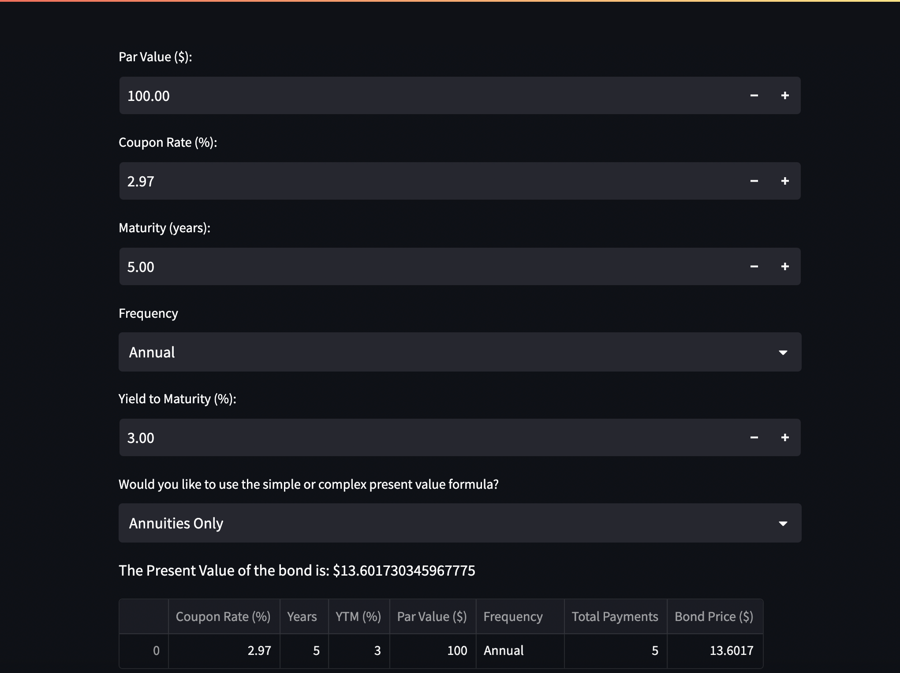
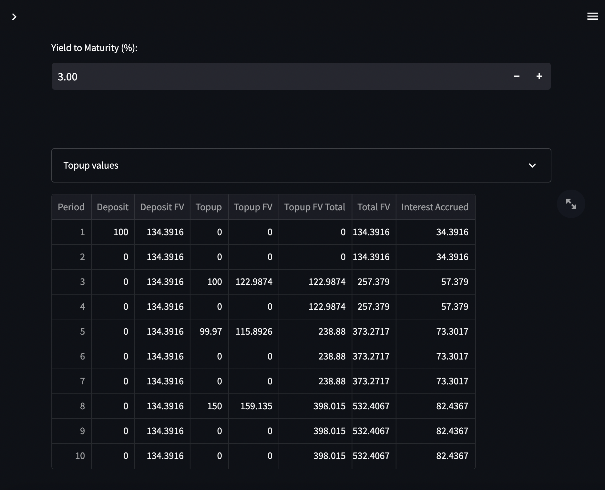
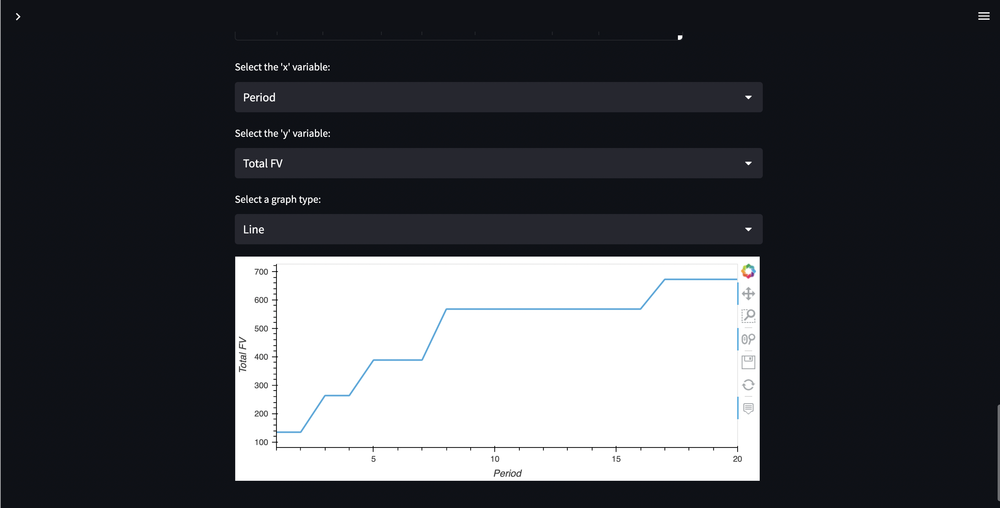

# BondMasterPro

A Streamlit application for financial professionals to evaluate and assess the performance of their fixed-income security portfolio.


## Background

The Fixed Income Portfolio Manager is a comprehensive tool designed to assist you in managing, analyzing, and visualizing your fixed-income portfolio. Whether you are an individual investor or a professional fund manager, this application provides a range of features to help you make informed investment decisions and monitor your bond holdings effectively.


## Features
Note that many features are still in development


### Fixed-income Calculator



The Fixed-income Calculator allows you to calculate the present value of a bond based on its coupon rate, maturity date, and yield-to-maturity. You can also calculate the yield-to-maturity of a bond based on its coupon rate, maturity date, and market price. These calculations are useful for evaluating the value of a bond and determining whether it is a good investment opportunity. 

The Fixed-income calculator allows the user to specify whether they wish to isolate the returns from the coupon payments or the capital appreciation of the bond. This is useful for investors who wish to isolate the returns from the coupon payments or the capital appreciation of the bond.

### Multiple Cashflows 



The multiple cashflows page allows investors to visualize how regular topups, at intervals of their choosing, can affect the value of their portfolio. This is useful for investors who wish to see how regular topups can affect the value of their portfolio.

The investor can likewise specify the variables they wish to isolate for the visualizations, the application supports line, bar, and scatter plot functionality aswell. 




#### Coming soon... ==>
### Security Finder 

The Security Finder allows you to search for and load bond information based on the International Securities Identification Number (ISIN). By entering the ISIN of a security, you can retrieve key details such as the security name, issuer, maturity date, currency, credit ratings, market price, yield-to-maturity, and more.

### Portfolio Analysis Tools
The Portfolio Analysis Tools provide essential calculations and metrics to evaluate your fixed-income portfolio. You can calculate metrics like Yield to Maturity, Duration, Convexity, and Present Value for individual securities or the entire portfolio. These metrics offer insights into the risk and return characteristics of your holdings, helping you make informed investment decisions.

### Scenario Analysis
The Scenario Analysis tool enables you to perform "what-if" analyses on your bond portfolio. By adjusting input parameters such as interest rates, credit spreads, or bond prices, you can observe the impact on the valuation and performance of your securities. This feature is valuable for evaluating different scenarios and understanding the sensitivity of your portfolio to changing market conditions.

### Risk Management
The Risk Management tools assist in assessing potential risks associated with fixed-income securities and managing portfolios accordingly. You can analyze credit risk by considering credit ratings and credit spreads, assess interest rate risk through duration and convexity calculations, and evaluate market risk based on historical data and volatility measures.

### Reporting and Visualization
The Reporting and Visualization tools allow you to generate customized reports and charts to present your findings and insights. You can create visual representations of your portfolio composition, performance metrics, yield curves, and other relevant data. These visualizations help you communicate complex information in a clear and visually appealing manner.

### Data Export
The application provides the option to export your bond data and analysis results as CSV files. This feature allows you to save and share your portfolio information for further analysis or reporting purposes.

### How to Use

- Security Finder: Enter the ISIN of a bond to load its information.
Portfolio Analysis Tools: Access various metrics and calculations to evaluate your portfolio's performance and risk.

- Scenario Analysis: Adjust input parameters to simulate different market scenarios and observe their impact on your portfolio.

- Risk Management: Assess and manage risks associated with fixed-income investments using various risk management tools.

- Reporting and Visualization: Generate reports and visualizations to effectively communicate your portfolio insights.

- Data Export: Save your bond data and analysis results as CSV files for further analysis or reporting.

The Fixed Income Portfolio Manager is designed to simplify the management and analysis of fixed-income portfolios, enabling you to make informed investment decisions and optimize your bond holdings.

## Technologies

- Python 3.8.5
- Streamlit 0.84.2
- Pandas 1.3.2
- Numpy 1.21.2
- Matplotlib 3.4.3
- Plotly 5.3.1
- Yfinance 0.1.63
- Finquant 0.2.2
- Quantstats 0.0.30
- Quantmod 0.4.27
- Numpy Finance 1.3.1

## Installation

Use the package manager [pip](https://pip.pypa.io/en/stable/) to install the required packages.

```bash
pip install -r requirements.txt
```

## Usage

```bash
streamlit run app.py
```

## Contributing

Pull requests are welcome. For major changes, please open an issue first to discuss what you would like to change.

## License

[MIT](https://choosealicense.com/licenses/mit/)